# Notes de version

## Version 1.5
* Basé sur [Deetazilla](https://github.com/Logimethods/deetazilla)

# smart-meter
Pour démontrer une application Big Data pour les compteurs intelligents.

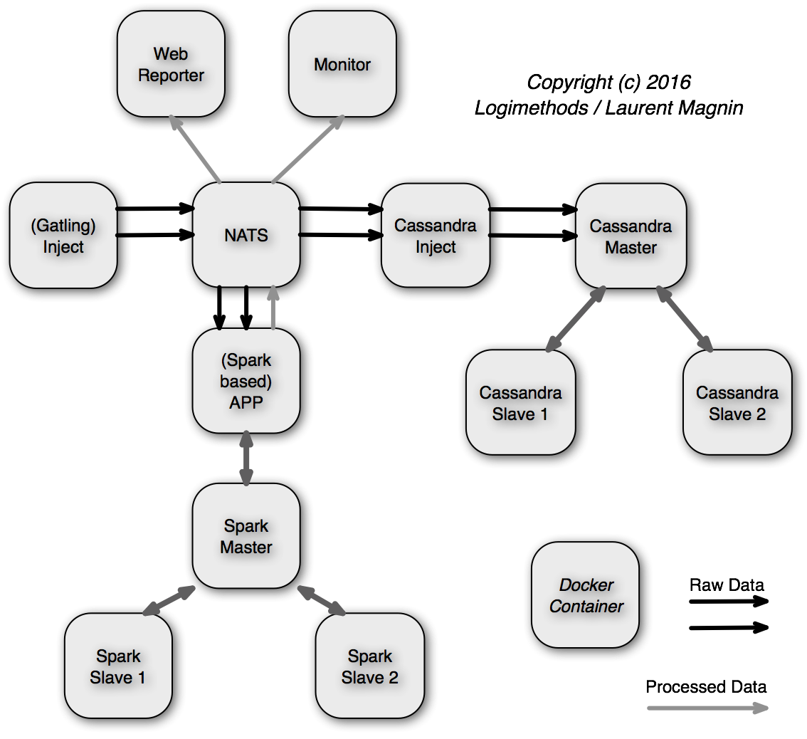

## Exécution de Docker

```
  scripts> ./compose_classic.sh
```    

## Docker Compose

```
  > export docker_tag="1.5"
  > export NETWORK_NAME="smartmeter"
```    

* Tout d’abord, créez votre `docker-compose-merge.yml`:
    * Lorsque les Docker Secrets sont fournis :    
    `docker run --rm logimethods/smart-meter:app_compose-${docker_tag} combine_services -e "local" "single" "secrets" root_metrics inject streaming_metrics prediction_metrics > docker-compose-merge.yml`
    * Lorsque les Docker Secrets ne sont PAS fournis :    
    `docker run --rm logimethods/smart-meter:app_compose-${docker_tag} combine_services -e "local" "single" "no_secrets" root_metrics inject streaming_metrics prediction_metrics > docker-compose-merge.yml`
    * Pour utiliser des propriétés locales :
    ```
    docker run --rm -v `pwd`/alt_properties:/templater/alt_properties logimethods/smart-meter:app_compose-${docker_tag} \
    combine_services -p alt_properties -e "local" "single" "no_secrets" root_metrics inject streaming_metrics prediction_metrics \
    > docker-compose-merge.yml
    ```
* Enfin, démarrez les services en fonction du fichier `docker-compose-merge.yml` précédemment généré :
```
./docker-[local | remote]-[single | cluster]-up.sh
.../...
./docker-[local | remote]-down.sh
```

## Interface de ligne de commande Python (CLI)

### Local

Voir [start-services.py](start-services.py)
```
> python3 -i ./start-services.py
>>> run_inject()
>>> run_app_batch()
...
>>> stop_all()
...
>>> exit()
```

Configurez les sources de données Grafana (voir ci-dessous) + Importez [gatling + max voltage.json](dockerfile-app_metrics/gatling%20%2B%20max%20voltage.json)

[http://localhost/dashboard/db/gatling-max-voltage](http://localhost/dashboard/db/gatling-max-voltage)

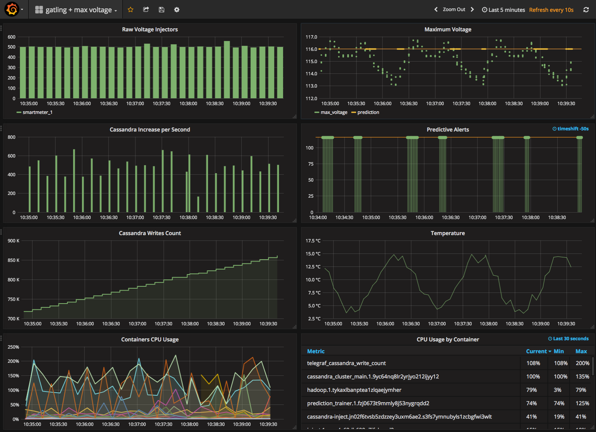

En parallèle, vous pouvez ajuster le nombre d’injecteurs :
```
> docker service scale inject=2
> docker service scale inject=1
```

### Local (DEV mode)

```
> ./build_DEV.sh
> ./stop.sh
> python3 -i start-services.py "local" "single" "-DEV"
Images will be postfixed by -DEV
>>> run_inject()
```

### À distance (sur Docker Swarm)

```
> ssh -NL localhost:2374:/var/run/docker.sock docker@xxxxx.amazonaws.com &
> python3 -i ./start-services.py "remote" "cluster"
> Remote Docker Client
>>> run_inject_cluster()
...
>>> stop_all()
...
>>> exit()
```

Configurez les sources de données Grafana (voir ci-dessous) + Importez [gatling + max voltage - swarm.json](dockerfile-app_metrics/gatling%20%2B%20max%20voltage%20-%20swarm.json).

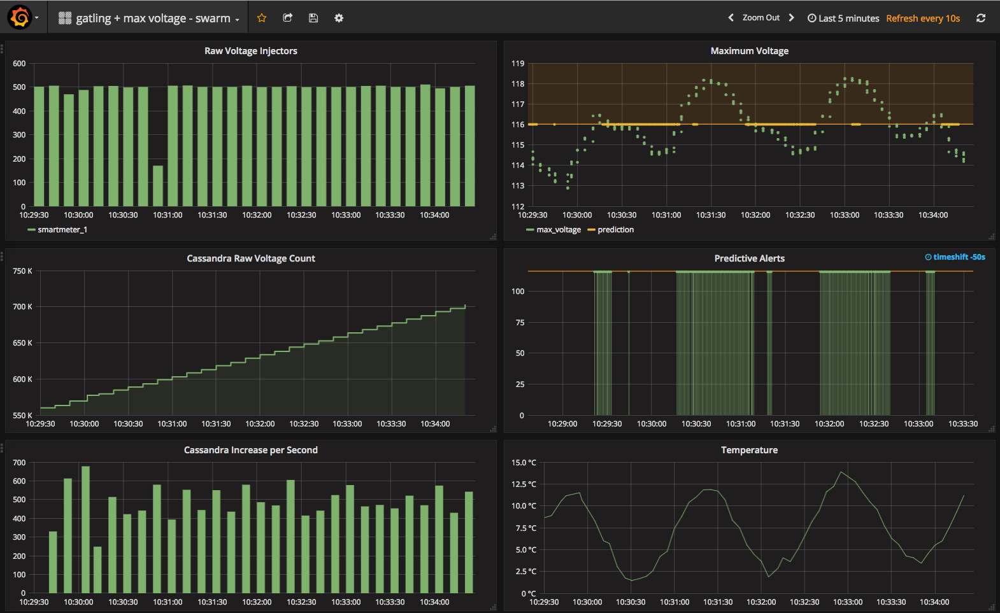

## Architectures
L’architecture de démonstration *Injection* :
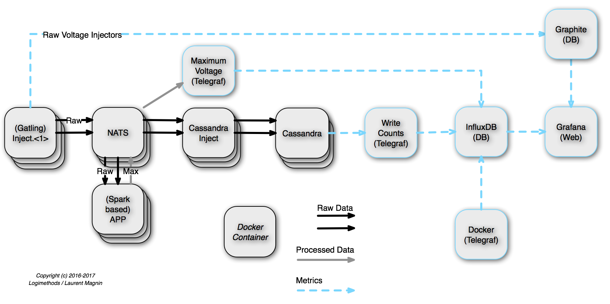

L’architecture de démonstration *Batch* :

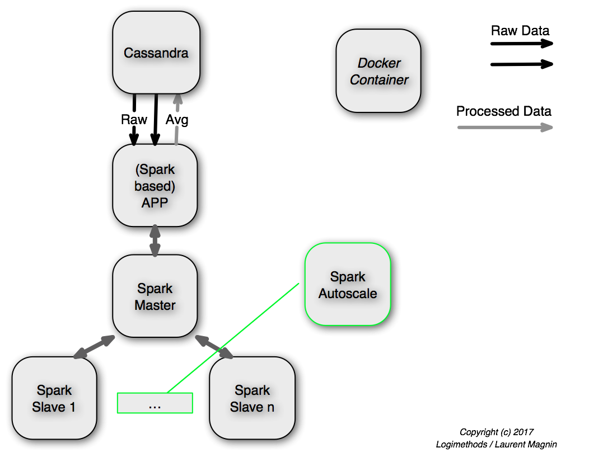

## Grafana Setup

/!\ Pour vous connecter à Grafana, utilisez `admin` comme nom d’utilisateur, avec le mot de passe défini par la variable `GF_SECURITY_ADMIN_PASSWORD` dans le fichier [configuration.properties](properties/configuration.properties#L98).

Depuis [Grafana](http://localhost:80), configurez les sources de données Graphite, InfluxDB et Prometheus :
```
> ./import_grafana_datasources.sh [grafana_URL]
```

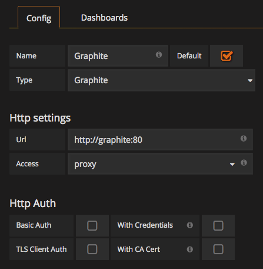
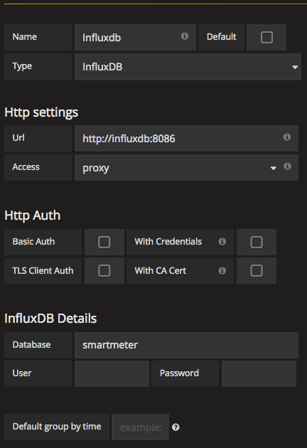
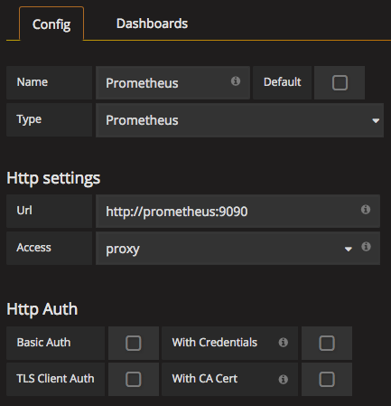

## CQLSH (CLI Cassandra )
Pour accéder aux données brutes de tension :
```
> docker exec -it $(docker ps | grep cassandra-cluster-main | awk '{print $NF}' ) cqlsh
Connected to Smartmeter Cluster at 127.0.0.1:9042.
[cqlsh 5.0.1 | Cassandra 3.5 | CQL spec 3.4.0 | Native protocol v4]
Use HELP for help.
cqlsh> select * from smartmeter.raw_data limit 2;

line | transformer | usagepoint | year | month | day | hour | minute | day_of_week | demand | val10 | val11 | val12 | val3 | val4 | val5 | val6 | val7 | val8 | val9 | voltage
------+-------------+------------+------+-------+-----+------+--------+-------------+--------+-------+-------+-------+------+------+------+------+------+------+------+-----------
  11 |           2 |          5 | 2019 |     3 |  17 |   12 |     13 |           0 |    100 |    10 |    11 |    12 |    3 |    4 |    5 |    6 |    7 |    8 |    9 | 114.76842
  11 |           2 |          5 | 2019 |     3 |  17 |   11 |     58 |           0 |    100 |    10 |    11 |    12 |    3 |    4 |    5 |    6 |    7 |    8 |    9 | 114.10834
```

## Entraînement & Prédictions

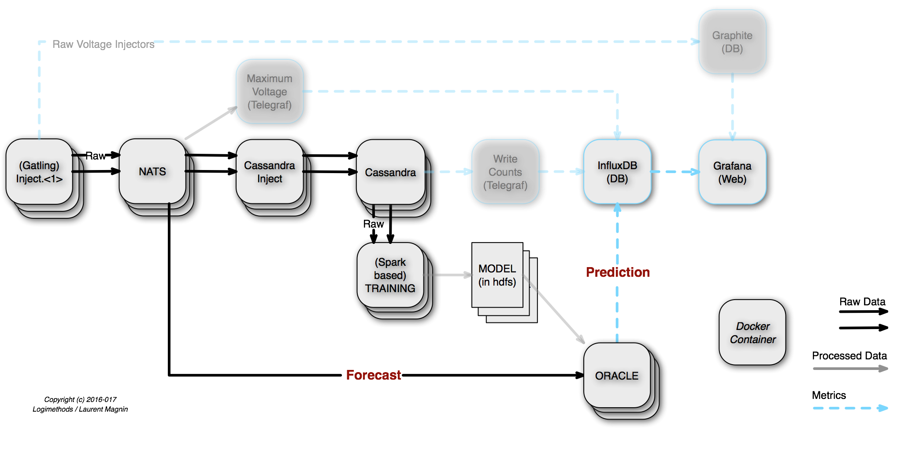

Voir [Multilayer perceptron classifier](http://spark.apache.org/docs/latest/ml-classification-regression.html#multilayer-perceptron-classifier) et [SparkPredictionProcessor.scala](dockerfile-app-streaming/src/main/scala/com/logimethods/nats/connector/spark/app/SparkPredictionProcessor.scala)
```
+-----+----------+----+--------------------+--------------------+---------+-----------+--------------------+----------+
|label|   voltage|hour|             hourSin|             hourCos|dayOfWeek|temperature|            features|prediction|
+-----+----------+----+--------------------+--------------------+---------+-----------+--------------------+----------+
|    0| 115.36195|  13| -12.940958284226115| -48.296289698960514|        0| -1.1098776|[-12.940958284226...|       0.0|
|    0|115.378006|  14| -24.999994594456457|   -43.3012733101135|        0|  16.545746|[-24.999994594456...|       0.0|
|    0|  116.9641|   3|   35.35533905932737|   35.35533905932738|        0|   4.004334|[35.3553390593273...|       0.0|
|    1| 118.92017|  23|  -12.94095828422611|  48.296289698960514|       50|  21.167358|[-12.940958284226...|       0.0|
|    1| 119.15324|  12|6.123233995736766...|               -50.0|       50| -12.110409|[6.12323399573676...|       1.0|
|    0|  115.1506|  14| -24.999994594456457|   -43.3012733101135|        0|  10.854811|[-24.999994594456...|       0.0|
|    0|115.264404|  14| -24.999994594456457|   -43.3012733101135|        0|  17.071587|[-24.999994594456...|       0.0|
.../...
|    1| 117.36004|   9|   35.35533905932738|  -35.35533905932737|       50|  -12.67373|[35.3553390593273...|       1.0|
|    1| 117.69681|  19|  -48.29628969896052|   12.94095828422609|       50|  17.909231|[-48.296289698960...|       0.0|
|    1|117.809166|  21| -35.355339059327385|   35.35533905932737|        0|   7.070238|[-35.355339059327...|       1.0|
|    0| 115.50017|  16|  -43.30127331011349|  -24.99999459445649|        0|  18.125008|[-43.301273310113...|       0.0|
+-----+----------+----+--------------------+--------------------+---------+-----------+--------------------+----------+
affichant uniquement les 20 premières lignes

Précision de l'ensemble de Test = 0.9642857142857143
```

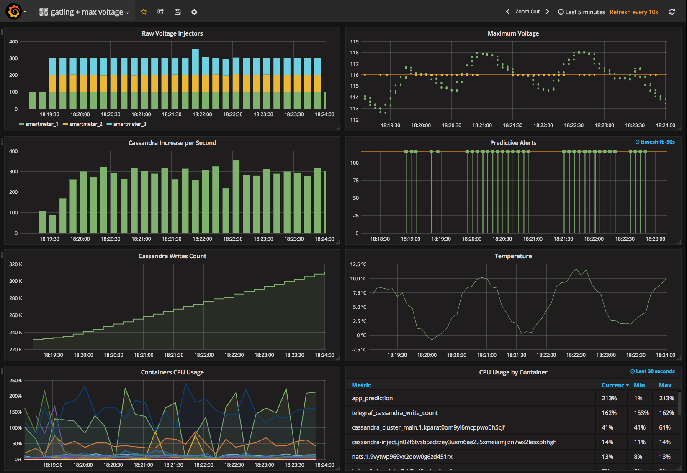

Les modèles ML générés sont stockés dans HDFS (sur le port `50070`): [Browsing HDFS](http://localhost:50070/explorer.html#/smartmeter/voltage_prediction.model/)

## Métriques supplémentaires

### Métriques NATS
Configurez les sources de données Grafana + Importez [NATS Servers.json](dockerfile-app_metrics/NATS%20Servers.json).
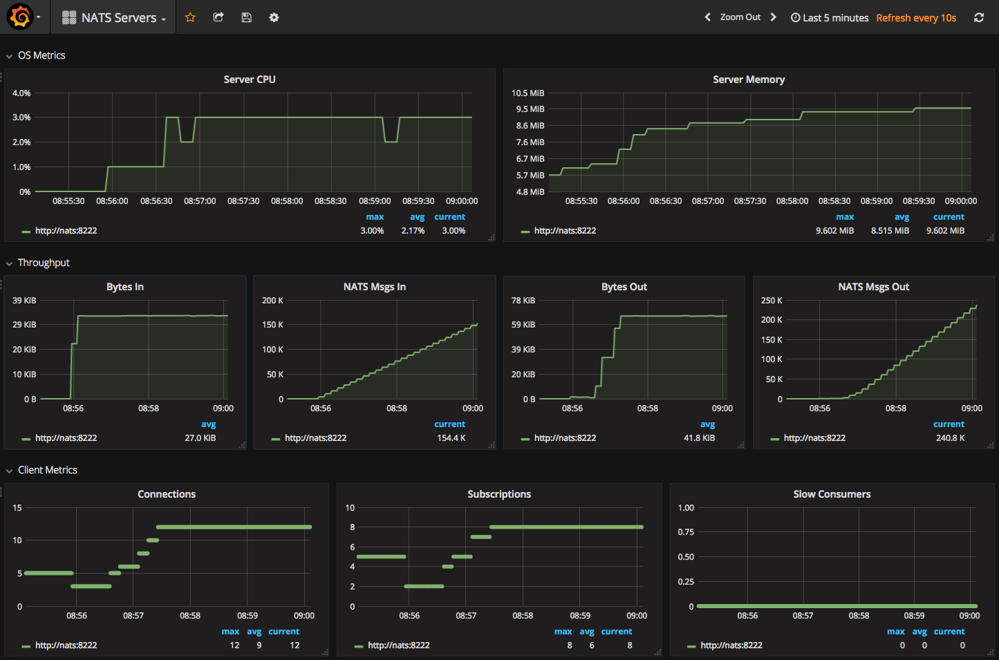

## Excel

### Installer le pilote ODBC

* Obtenez le pilote sur http://www.simba.com/drivers/cassandra-odbc-jdbc/
* Suivez les instructions d’installation (sur MacOS, n’oubliez pas d’installer d’abord [iODBC](http://www.iodbc.org/))
* Enregistrez le fichier de licence que vous avez reçu par mail (`SimbaApacheCassandraODBCDriver.lic`) au bon endroit

### Créer un fichier SDN

* Définissez un fichier SDN, tel que [excel/cassandra.dsn](excel/cassandra.dsn)
* Vous pouvez le charger et le tester directement via l’application iODBC Administrator :
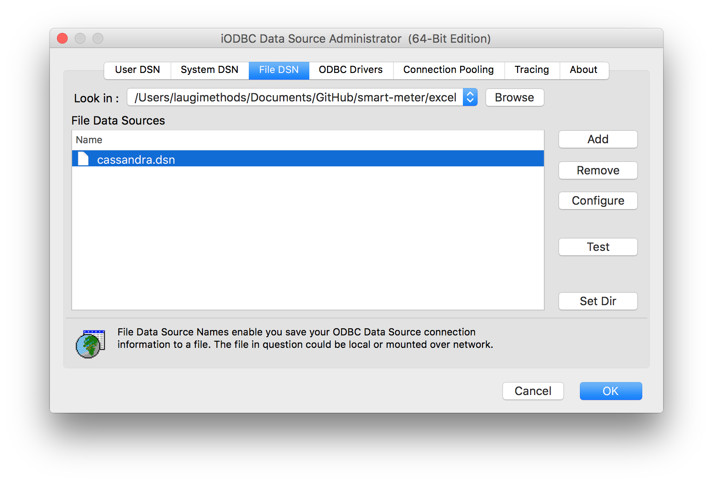

### Connecter aux données externes depuis Excel en utilisant `iODBC Data Source Chooser` (File DSN)

* Vous pouvez utiliser la syntaxe SQL, telle que select `select * from smartmeter.raw_data limit 10;`
* Et Voilà!

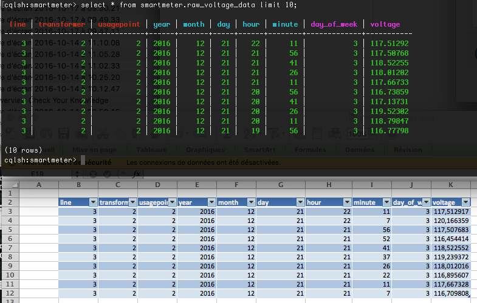

# Build
## Build local (legacy)
```
/smart-meter/scripts > ./docker_build.sh dockerfile-app_streaming
```

## [Concourse](http://concourse.ci/) Intégration Continue

Voir [Concourse Pipeline](concourse/smart_meter-pipeline.yml).

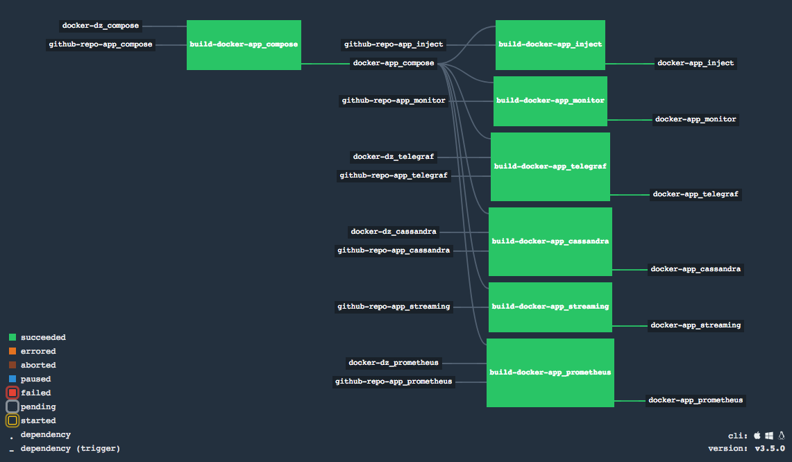

---

[](https://classroom.github.com/a/-_OVYpcQ)

** /!\ Travail en cours, ce README est entrain d'être complété. **