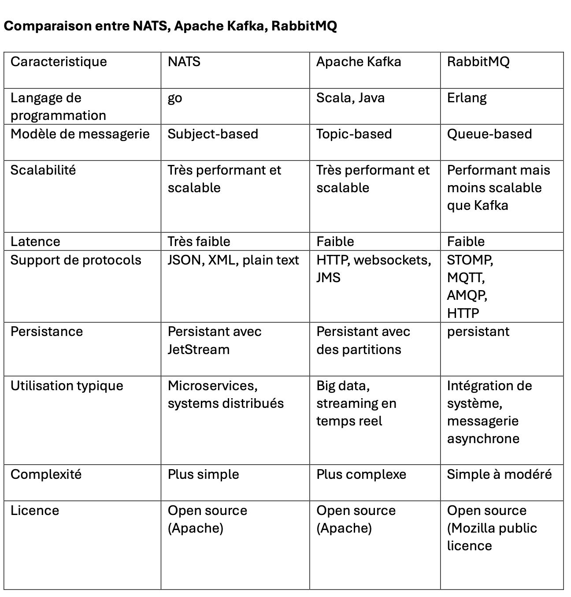

# Séance de présentation de projets d'équipe

**Date :** Mardi 12 novembre 2024  
**Lieu :** SH-3560, Pavillon Sherbrooke, Faculté des Sciences de l'UQAM  

## Projet d'équipe : Mise à niveau de l'application Smart-Meter

**Cours :** MGL7320 - Ingénierie Logicielle des Systèmes d'Intelligence Artificielle  
**Enseignant :** Laurent Yves Magnin  
**Courriel :** [magnin.laurent_yves@uqam.ca](mailto:magnin.laurent_yves@uqam.ca)  

**Organisation GitHub :** [![uqam-lomagnin][]](https://github.com/uqam-lomagnin)  
**Nom de l'équipe :** [![r00tAI][]](https://github.com/orgs/uqam-lomagnin/teams/r00tai)  
**GitHub de notre projet :** [![smartmeter-r00tai][]](https://github.com/uqam-lomagnin/smartmeter-r00tai)  

---

## Membres de l'équipe

| Nom et prénom                   | Courriel étudiant                            | Nom d'utilisateur GitHub           | Programme d'études                                             |
|---------------------------------|----------------------------------------------|------------------------------------|----------------------------------------------------------------|
| Francois Gonothi Toure           | toure.francois_gonothi@courrier.uqam.ca     | @gtfrans2re                        | Maîtrise en informatique (systèmes électroniques)               |
| Ben Bachir Aboubakar Nabil       | aboubakar_nabil.ben_bachir@courrier.uqam.ca | @BenBachirAboubakarNabil           | Maîtrise en génie logiciel                                      |
| Martial Zachee Kaljob Kollo      | kaljob_kollo.martial_zachee@courrier.uqam.ca | @kaljob                            | Maîtrise en informatique pour l'intelligence et la gestion des données |
| Sokhna Mariame Ndour             | ndour.sokhna_mariame@courrier.uqam.ca       | @zeyda97                           | Maîtrise en informatique (intelligence artificielle)           |

---

## Table des matières
- [Aperçu Général](#aperçu-général)
- [Exigences](#exigences)
- [Spécifications Techniques](#spécifications-techniques)
- [Architecture](#architecture)
- [Plan de Développement Prévu](#plan-de-développement-prévu)
- [Présentation des Outils](#présentation-des-outils)
- [Conclusion](#conclusion)
- [Annexes](#annexes)

---

## Aperçu Général
L'objectif principal de ce projet est de moderniser l'application **Smart-Meter** pour surmonter sa dette technique et optimiser ses performances, son évolutivité et sa documentation. Le projet se concentre sur l'implémentation d'une architecture microservices, l'intégration de technologies modernes pour le traitement et la visualisation des données, ainsi que sur l'optimisation de la collecte et de l'analyse des données en temps réel. Les principales améliorations comprennent la collecte des données de tension et de température des compteurs intelligents, le traitement distribué des données, et la visualisation en temps réel des métriques via Grafana.

---

## Présentation du Projet Smart-Meter - 12 Novembre
### Introduction
**Durée** : 15 minutes (estimatif)  
**Objectif** : Présenter les objectifs, exigences, plan de développement, et les choix techniques pour la mise à niveau de l’application Smart-Meter.  

---

## Exigences

### Objectifs et Contexte du Projet
- **Réduction de la dette technique** de l'application Smart-Meter.
- **Modernisation de l'architecture** pour améliorer performance, évolutivité et documentation.
- **Nouvelles fonctionnalités** pour gérer et analyser les données de tension et de température.

### Exigences fonctionnelles
- **Collecte des Données** : Collecte en temps réel des données des compteurs intelligents via Gatling et NATS.
- **Stockage** : Stocker les données dans Cassandra de manière persistante.
- **Traitement** : Traitement distribué des données via Apache Spark pour des agrégations et prédictions.
- **Surveillance** : Surveiller les écritures dans Cassandra avec Telegraf et envoyer les métriques à InfluxDB.
- **Visualisation** : Visualiser les métriques et les analyses dans Grafana.
- **Déploiement Automatisé** : Utiliser Docker pour conteneuriser les services.

### Exigences non fonctionnelles
- **Tolérance aux Pannes** : Haute disponibilité des données avec Cassandra.
- **Performance** : Faibles temps de réponse, traitement rapide avec Go et Spark.
- **Portabilité** : Conteneurisation avec Docker pour le déploiement portable.
- **Surveillance et Alertes** : Surveillance avec Telegraf, visualisation et alertes dans Grafana.

---

## Spécifications Techniques

---

### Langages
- **Scala** : Utilisé pour les simulations de tests de charge via Gatling et pour les scripts de traitement des données dans Apache Spark.
  - **Alternative** : Java ou PySpark pour simplifier la maintenance.
- **Go** : Utilisé pour le composant Cassandra Inject, responsable de l'injection des données des compteurs dans Cassandra.
  - **Alternative** : Python/Java pour la simplicité et la flexibilité.
- **Shell (Bash)** : Scripts de déploiement, collecte de statistiques, et configuration des services comme Telegraf et Cassandra.

### Base de Données
- **Cassandra** : Utilisé pour le stockage des données de séries temporelles provenant des compteurs intelligents. La réplication des données est activée pour garantir la tolérance aux pannes.
  - **Recommandation** : Cassandra 4.x pour les améliorations de performances et de sécurité.

### Services de Messagerie et de Flux de Données
- **NATS** : Système de messagerie léger pour les communications asynchrones entre les composants.
  - **Recommandation** : Apache Kafka pour une persistance des messages accrue et gestion des flux.

### Traitement des Données
- **Apache Spark (avec MLlib)** : Utilisé pour le traitement des données, les agrégations, et les analyses prédictives.
  - **Recommandation** : PySpark pour une meilleure lisibilité et communauté active.

### Surveillance et Collecte des Métriques
- **Telegraf** : Agent de collecte de métriques utilisé pour surveiller Cassandra et d'autres composants.
- **InfluxDB** : Base de données de séries temporelles pour stocker les métriques de Telegraf.
- **Grafana** : Outil de visualisation des métriques et analyses de données.

### Conteneurisation et Orchestration
- **Docker** : Tous les composants sont conteneurisés pour assurer portabilité et consistance entre environnements.
- **Docker Compose** : Utilisé pour déployer les services localement.
  - **Alternative** : Kubernetes pour le déploiement en cluster.

### Types de Smart-Meters
- Types et provenance des smart-meters en attente de confirmation.

---

## Architecture

### Architecture Globale
- Architecture de type microservices pour modularité et maintenance.
  - **Simulation des Données** : Utilisation de K6 pour tester la capacité du système.
  - **Système de Messagerie** : Apache Kafka pour transfert asynchrone et persistant des messages.
  - **Traitement des Données** : Apache Spark pour simuler les données des compteurs.
  - **Surveillance des Performances** : Prometheus et Grafana pour surveiller l'état des composants.
  - **Stockage des Données** : ScyllaDB ou Cassandra 4.x pour le stockage distribué.

### Architecture détaillée avec visuels
- Schéma de flux de données entre Kafka/Kinesis et le backend.
- Illustrations des architectures d’injection et d'entraînement (voir annexes).

---

## Plan de Développement Prévu

### Étapes principales et calendrier
- **Phases de développement** : développement, test, déploiement.
- **Gantt Chart** : Visualisation des tâches et des livrables.

### Outils de Gestion de Projet
- **Jira** : Suivi des tâches et organisation des sprints.
- **Branches Git** : `dev` pour développement et `main` pour versions finales.

---

## Présentation des Outils

### Outils choisis pour le projet
- **Docker** : Conteneurisation des microservices.
- **Kafka / Amazon Kinesis** : Gestion des flux de données en temps réel.
- **Grafana** : Monitoring et visualisation des métriques.
- **Spark** : Pour l'entraînement des modèles de prédiction.
- **Jira et GitHub** : Suivi de projet et gestion de version.

---

## Conclusion

### Résumé des points principaux
- Modernisation de l’application pour réduire la dette technique, améliorer les performances, et fournir une documentation complète.

### Questions en suspens
- **Source des données de température** et confirmation des types de Smart-Meters.

### Plan d’Action immédiat
- Finaliser l’architecture et poursuivre le développement